# Hybrid Intrusion Detection and Prevention System (IDS/IPS)

A Hybrid Intrusion Detection and Prevention System combining:

- Snort 3 Signature-Based Detection
- Machine Learning-Based Anomaly Detection
- Automatic IP Blocking using IPTables
- Real-Time Flask Monitoring Dashboard

The system detects malicious network traffic, classifies attacks using behavioral and ML techniques, blocks suspicious IP addresses, and visualizes all events through a live SOC dashboard.

---

## Features

### Signature-Based Detection
- Snort 3 monitors network traffic.
- Detects ICMP scans, flooding, and suspicious packets.
- Generates real-time alerts.

### Machine Learning Detection
- Uses trained ML model (`hybrid_model.pkl`)
- Detects anomalous traffic patterns.
- Feature extraction:
  - Packet Rate
  - Unique Source IPs
  - Average Interval
  - Burst Flag

### Prevention
- Automatically blocks malicious IPs.
- Uses IPTables firewall rules.

### Monitoring Dashboard
- Live traffic monitoring
- Attack statistics
- Threat level indicator
- Top attacking IPs
- Blocked IP list
- Traffic visualization charts

---

## System Architecture

```text
Attacker VM
      │
      ▼
 Network Traffic
      │
      ▼
   Snort IDS
      │
      ▼
 Hybrid IDS Engine
(Signature + ML)
      │
      ▼
 alerts.json
      │
      ▼
 Flask Dashboard
```

---

## Technologies Used

### Security
- Snort 3
- IPTables

### Machine Learning
- Python
- Pandas
- Scikit-Learn
- Joblib

### Dashboard
- Flask
- HTML
- CSS
- JavaScript
- Chart.js

### Environment
- Ubuntu 24.04
- VMware Workstation

---

## Project Workflow

1. Snort captures packets.
2. Alerts are forwarded to Hybrid IDS Engine.
3. Features are extracted.
4. ML model performs classification.
5. Behavioral detection validates attacks.
6. Attack decision is made.
7. Malicious IPs are blocked.
8. Events are stored in:
   - alerts.json
   - dataset.csv
9. Dashboard updates in real time.

---

## Screenshots

### Dashboard Running

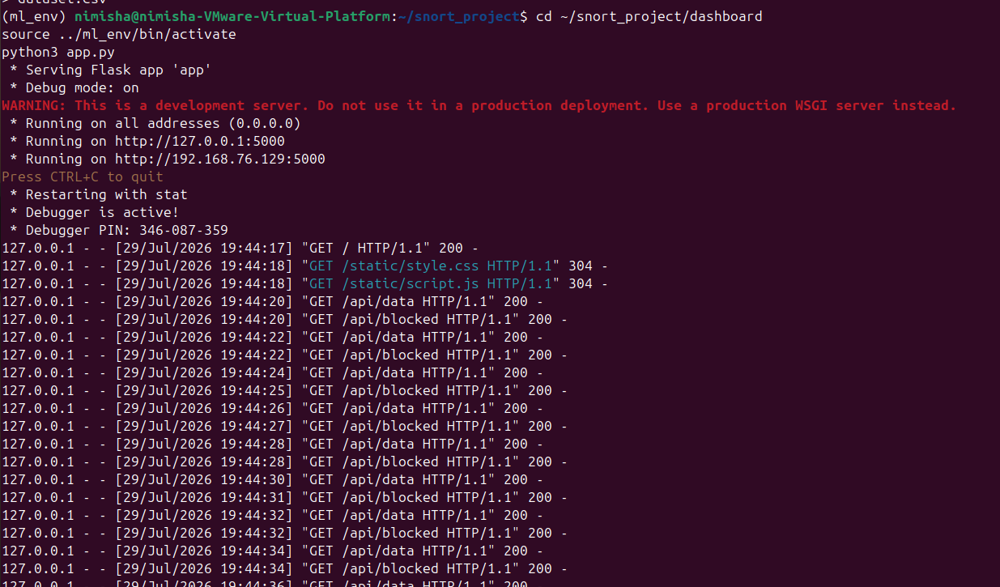

---

### Normal Traffic Detection

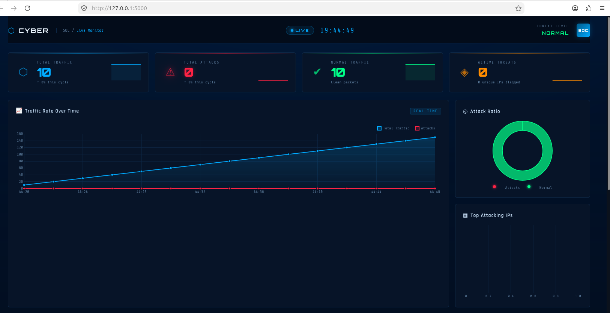

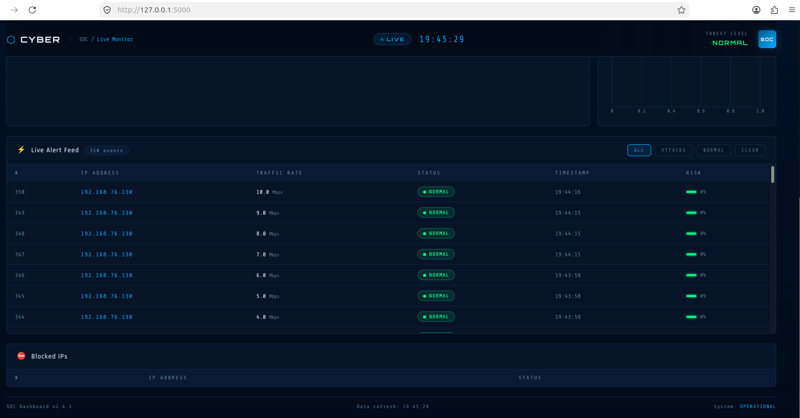

---

### Live Attack Detection

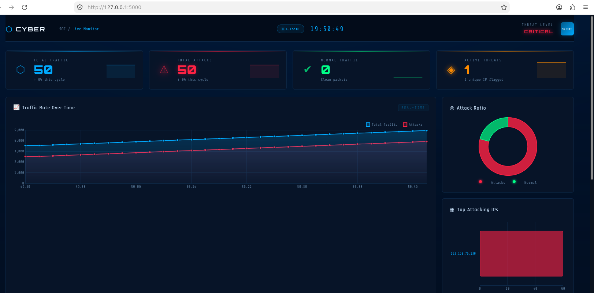

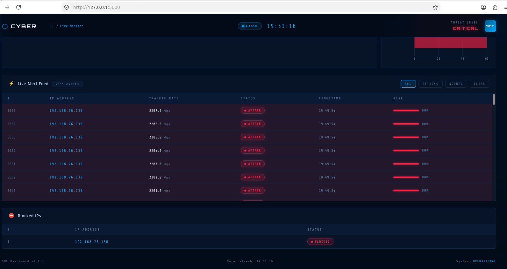

---

### Attack Detection Terminal

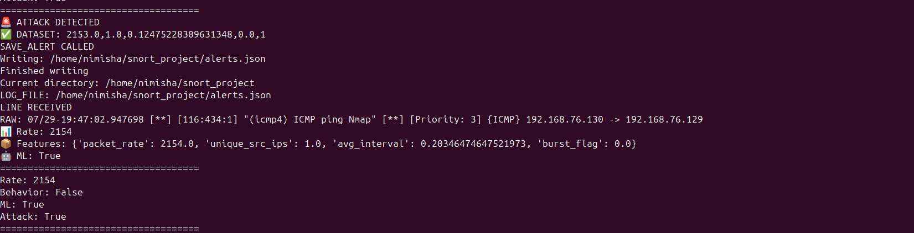

---

### Normal Detection Terminal

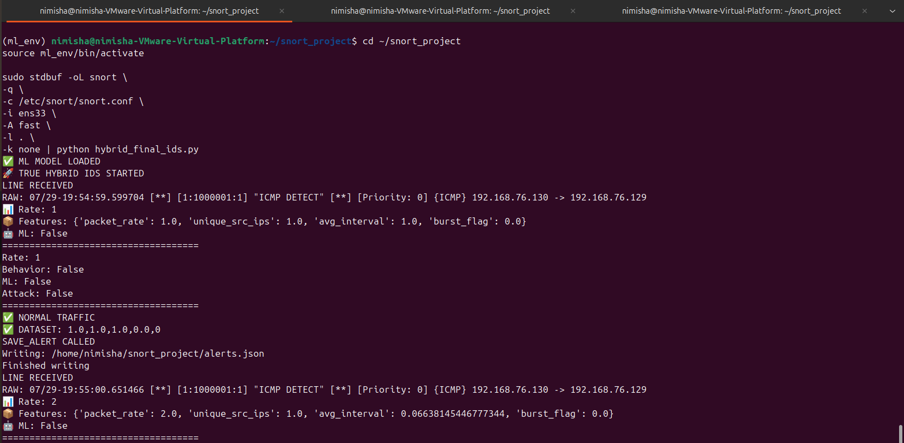

---

### Automatic IP Blocking

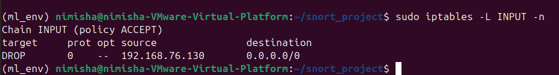

---

### Dataset Logging

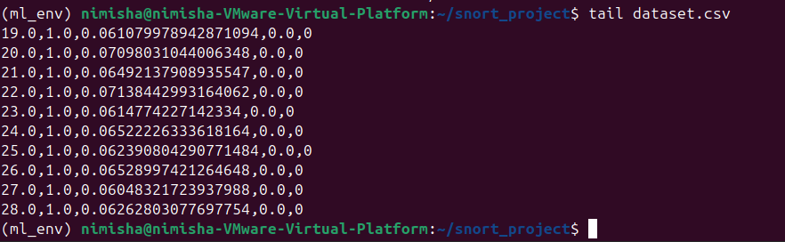

---

### JSON Alert Logging

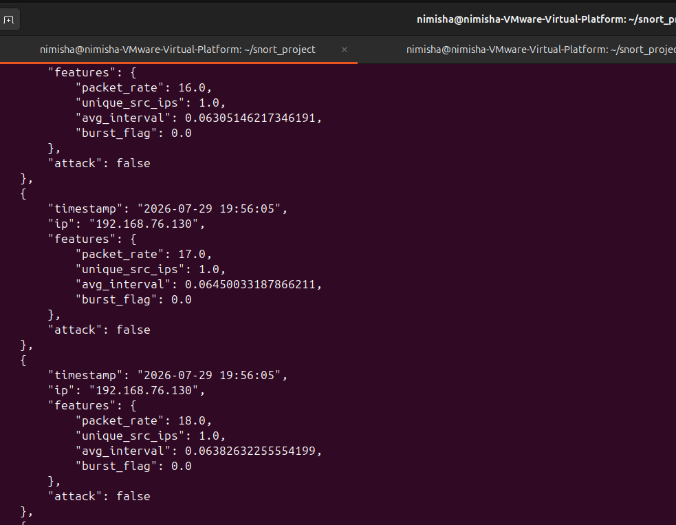

---

### Attacker VM

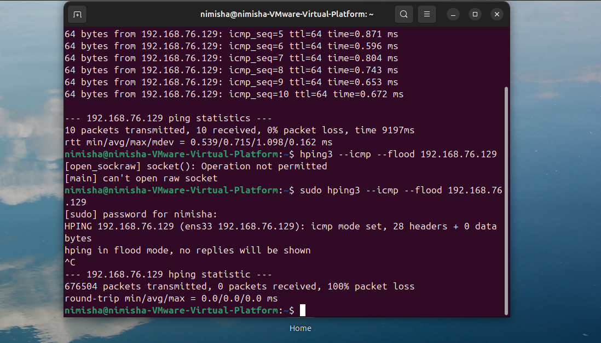

---

## Running the Project

### Activate Environment

```bash
cd ~/snort_project
source ml_env/bin/activate
```

### Start Dashboard

```bash
cd dashboard
python3 app.py
```

### Start Hybrid IDS

```bash
sudo stdbuf -oL snort \
-q \
-c /etc/snort/snort.conf \
-i ens33 \
-A fast \
-k none | python3 hybrid_final_ids.py
```

---

## Sample Attack Simulation

### ICMP Flood

```bash
hping3 --icmp --flood <target-ip>
```

### Ping Test

```bash
ping <target-ip>
```

---

## Results

- Successfully detected normal traffic.
- Successfully detected attack traffic.
- ML model classified suspicious activity.
- Automatic firewall blocking implemented.
- Real-time monitoring dashboard developed.

---

## Future Enhancements

- Deep Learning-based Detection
- Multi-Attack Classification
- Email/SMS Alerts
- Threat Intelligence Integration
- Cloud-Based Monitoring

---

## Author

Nimisha Khanzode

B.Tech Computer Science Engineering

IoT and Cybersecurity Including Blockchain Technology

VIT Pune
